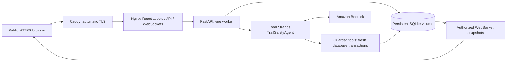

# Trail on AWS Lightsail

Trail uses one Ubuntu 24.04 Lightsail instance, Docker Compose, a persistent SQLite volume, and one FastAPI worker; no database migration is required.
Read [DEPLOYMENT_STATUS.md](DEPLOYMENT_STATUS.md) for the latest measured readiness; a provisioned hostname alone does not prove the demo works.



## 1. Prepare your computer and AWS account

Install Git, Python 3.13, Node.js 22, AWS CLI v2, and Docker with Compose 2.24.4 or newer.
Open PowerShell in this repository and run:

```powershell
python -m venv .venv
.venv\Scripts\python.exe -m pip install -r backend/requirements.txt -r requirements-deploy.txt
aws configure
aws sts get-caller-identity
```

The configured operator must have Lightsail permissions to create/read instances and SSH keys, allocate/attach static IPs, set firewall ports, and obtain SSH access details.
An administrator can grant the scoped IAM permissions in [deploy/operator-iam-policy.json](deploy/operator-iam-policy.json) so the deployment script can create a dedicated runtime user; alternatively, the administrator can create that user and supply its credentials directly in the ignored `.env.production` file.
Do not put credentials in chat, Git, Docker build arguments, or a frontend environment variable.

To apply the scoped operator policy, sign in with an AWS administrator, open **IAM → Users → dev → Permissions → Add permissions → Create inline policy**, choose **JSON**, paste the contents of `deploy/operator-iam-policy.json`, and save it as `TrailRuntimeUserSetup`.
This grants setup permissions only for the named Trail runtime user; it does not grant general IAM administration; see [AWS inline policy instructions](https://docs.aws.amazon.com/IAM/latest/UserGuide/access_policies_manage-attach-detach.html).

## 2. Create the Lightsail service

```powershell
.venv\Scripts\python.exe scripts/deploy_aws.py provision
```

The script requests `trail-live-demo` in `us-west-2a` using Ubuntu 24.04 and the `small_3_0` Linux bundle: 2 GB RAM, two vCPUs, and 60 GB disk.
Run the same command again after about a minute; it finishes static-IP attachment and firewall setup without creating another instance.
Port 22 is restricted to your current public IP, and only ports 80 and 443 are public; the database and API have no published ports.

The bundle is currently $12/month plus Bedrock usage and any applicable transfer charges; see [Lightsail pricing](https://aws.amazon.com/lightsail/pricing/).
The script installs Docker, enables restart at boot, adds 2 GB swap for builds, and records resource names in ignored `.local/deployment.json`.
Keep that file and `.local/trail-deploy.pem` private and backed up; they identify and administer your deployment.

For a manual console deployment, open **Lightsail → Create instance → Linux/Unix → OS Only → Ubuntu 24.04**, select the 2 GB IPv4 bundle, paste `deploy/bootstrap.sh` into the launch script, and create/attach a static IP under **Networking**.
Then configure the same ports and copy the repository into `/opt/trail`; the automated script is the tested path for this repository.

## 3. Configure the hostname and HTTPS

By default the script creates a hostname such as `trail.35-160-30-196.sslip.io`, which resolves to the static IPv4 address without purchasing a domain.
This is a shared public DNS service; using your own domain removes that dependency.
For your domain, create an A record pointing to the static IP, then run `scripts/deploy_aws.py provision --host trail.yourdomain.com` before creating the production environment file.
If changing an existing deployment, also update `TRAIL_HOST` in `.env.production` before redeploying.

Caddy obtains and renews public certificates automatically, redirects HTTP to HTTPS, and persists certificates in `trail_caddy-data`; keep ports 80/443 reachable and DNS pointed at the instance.
Nginx serves the production React build and forwards `/api/` and `/ws/`; the browser uses relative API URLs and selects `wss://` from the HTTPS page URL.
See [Caddy automatic HTTPS](https://caddyserver.com/docs/automatic-https) and [Lightsail static IPs](https://docs.aws.amazon.com/lightsail/latest/userguide/lightsail-create-static-ip.html).

## 4. Configure real Bedrock access and secrets

In the AWS Bedrock console, select **us-west-2** and confirm that the account can invoke the configured Anthropic model; complete any Anthropic use-case or model-access requirements presented by AWS.
The current model is `global.anthropic.claude-sonnet-4-6`, a global inference profile; its permissions must include both the profile and destination foundation-model ARNs.
See [AWS inference-profile prerequisites](https://docs.aws.amazon.com/bedrock/latest/userguide/inference-profiles-prereq.html).

```powershell
.venv\Scripts\python.exe scripts/deploy_aws.py configure-runtime
```

This creates `trail-live-demo-bedrock` with only `bedrock:InvokeModel` and `bedrock:InvokeModelWithResponseStream` for this model/profile, generates its key, generates a JWT signing secret, and saves `.env.production` without printing secrets.
Existing `.env.production` is preserved; a retry does not rotate credentials or invalidate accounts.
If an administrator supplies credentials manually, copy `.env.production.example` to `.env.production`, set the actual hostname, generate a random JWT secret of at least 32 characters, and fill the two AWS credential fields in a local editor.

Important settings:

| Variable | Production value / purpose |
|---|---|
| `TRAIL_HOST` | Public hostname without `https://` or a trailing slash |
| `TRAIL_AGENT_MODE` | `bedrock`; production rejects `mock` |
| `AWS_REGION` | `us-west-2` |
| `BEDROCK_MODEL_ID` | `global.anthropic.claude-sonnet-4-6` |
| `JWT_SECRET` | Persistent random secret; changing it invalidates existing cookies |
| `AWS_ACCESS_KEY_ID`, `AWS_SECRET_ACCESS_KEY` | Dedicated Bedrock runtime user |
| `COOKIE_SECURE` | Forced `true` by production Compose |
| `DATABASE_URL` | Forced `sqlite:////data/trail.db` by production Compose |
| `CORS_ORIGINS` | Forced to `https://${TRAIL_HOST}` |
| `PUBLIC_DEMO`, `DEMO_MODE` | `true`; judge sessions use synthetic inputs without GPS |
| `AGENT_TIMEOUT_SECONDS` | 60 seconds per real Strands invocation |
| `MAX_ACTIVE_SESSIONS` | 10 simultaneous demo sessions |
| `MAX_DEMO_STARTS_PER_HOUR` | 60 starts per hour across the instance |
| `DEMO_SESSION_LIFETIME_SECONDS` | 600; timed-out demos remain in history |

Bedrock errors are visible as `AGENT_ERROR` and `agent_status=ERROR`; any deterministic policy fallback is labelled `policy`, and the application never substitutes the offline model for Bedrock.
Tool audit records contain the real tool name, sanitized return value, provider, and invocation ID; successful Strands records also contain SDK token usage and model identity.

## 5. Deploy from this repository

```powershell
.venv\Scripts\python.exe scripts/deploy_aws.py deploy
```

The script packages versionable repository files, excludes local databases and secrets, uploads over SSH/SFTP, transfers `.env.production` separately with mode 600, and runs `deploy/update.sh`.
It builds the backend and production frontend on the instance and starts Caddy, Nginx, and FastAPI with restart policies.
The first SSH host key is pinned locally when Lightsail does not return its host keys; subsequent connections reject a changed key.

You can build the AWS images before runtime credentials are available using `scripts/deploy_aws.py build`; this does not start a public application.
If SSH fails after your home IP changes, rerun `provision` to update the firewall rule.

## 6. Verify before sharing with judges

```powershell
.venv\Scripts\python.exe -m pytest backend/tests -q
Push-Location frontend
npm ci
npm run typecheck
npm run build
Pop-Location
.venv\Scripts\python.exe scripts/verify_deployment.py --url https://YOUR_HOST
```

The live verification creates a disposable account and checks secure authentication, CORS rejection, actual WSS map snapshots, Normal Demo, Safety Demo, Bedrock token usage, model-selected check-in/contact/community tools, persisted outcomes, community redaction, history, and lost-item retracing.
Allow roughly three minutes and expect Bedrock usage charges.
It writes a non-secret report under `.local` and an ignored disposable-account file for persistence verification.

```powershell
.venv\Scripts\python.exe scripts/deploy_aws.py remote --command 'cd /opt/trail && docker compose --env-file .env.production -f compose.production.yml restart'
.venv\Scripts\python.exe scripts/verify_deployment.py --url https://YOUR_HOST --persistence
```

Also open the public page in a browser: choose **Run Normal Demo**, then **End Trail**, then **Run Safety Demo**; leave the safety countdown unanswered to see escalation, and open **View actual Strands tool executions** in Trail activity.
Use **Following → Preview demo recipients** for trusted-contact alerts and **Community → Preview demo recipients** for the coarse assistance zone; these are owner-authorized previews of persisted backend data.
History and **Retrace a Trail** provide the recorded route and computed search points.

### Local production-container verification

Copy `.env.production` to ignored `.env.container`, keep real Bedrock credentials, and change `TRAIL_HOST` to `localhost`.
Use the same images with an isolated database volume and local TLS:

```powershell
docker compose -p trail-local --env-file .env.container -f compose.production.yml -f compose.local-test.yml up -d --build --wait
docker cp trail-local-https-1:/data/caddy/pki/authorities/local/root.crt .local/local-ca.crt
.venv\Scripts\python.exe scripts/verify_deployment.py --url https://localhost:8443 --ca-file .local/local-ca.crt --report .local/local-production-verification.json
docker compose -p trail-local --env-file .env.container -f compose.production.yml -f compose.local-test.yml restart
.venv\Scripts\python.exe scripts/verify_deployment.py --url https://localhost:8443 --ca-file .local/local-ca.crt --report .local/local-production-verification.json --persistence
```

The local CA is trusted only by the verification client, without disabling certificate checks or installing it system-wide.
On Windows with Docker running directly inside WSL, keep a WSL terminal open during the test so WSL does not stop the service when the last foreground command exits.

## 7. Storage, updates, and logs

SQLite is stored at `/data/trail.db` inside named volume `trail_trail-data`; WAL/shm files stay beside it, and the volume survives container replacement, Compose restart, and instance reboot.
One Uvicorn worker owns the watchdog; inference runs outside short write transactions, and every actual tool reloads authorization and session state before writing.
Do not scale worker count or replicas while using this SQLite watchdog design.

Redeploy local edits with the same `deploy` command; on the server, a Git-based checkout can be updated with `git pull` followed by `bash deploy/update.sh`.
Do not use `docker compose down -v` unless intentionally deleting the demo database and certificates.
Take a Lightsail instance snapshot before a major update, or use SQLite's online backup API rather than copying an active database without its WAL.
Snapshots incur separate charges and should be removed when no longer needed.

```powershell
.venv\Scripts\python.exe scripts/deploy_aws.py remote --command 'cd /opt/trail && docker compose --env-file .env.production -f compose.production.yml ps'
.venv\Scripts\python.exe scripts/deploy_aws.py remote --command 'cd /opt/trail && docker compose --env-file .env.production -f compose.production.yml logs --tail 100 backend https'
```

If HTTPS fails, check DNS, firewall ports, and Caddy logs; certificate-authority limits may require waiting or configuring your own hostname.
If Bedrock fails, check the runtime IAM policy, profile/model region access, and account prerequisites; never change production to mock mode to conceal a failure.
Routes and derived session data expire after ten days; normal demos stop calling Bedrock when complete, and public sessions end after ten minutes to bound costs.

## 8. Stop or remove resources to avoid charges

Stopping containers stops agent usage, but a stopped Lightsail instance still incurs instance charges.
For a temporary application pause, run `docker compose --env-file .env.production -f compose.production.yml stop` in `/opt/trail`.
To remove the deployment permanently, first export any data you need, then delete these resources in the AWS console or run:

```powershell
aws lightsail delete-instance --region us-west-2 --instance-name trail-live-demo
aws lightsail release-static-ip --region us-west-2 --static-ip-name trail-live-demo-ip
aws lightsail delete-key-pair --region us-west-2 --key-pair-name trail-live-demo-key
```

Wait for instance deletion before releasing the IP if it is still attached; delete any snapshots under **Lightsail → Snapshots**.
Under **IAM → Users → trail-live-demo-bedrock**, delete the runtime access key, remove the `TrailBedrockInvokeOnly` inline policy, and delete the user; IAM cleanup may require the administrator.
Finally remove local secret files when no longer needed and confirm Lightsail, snapshots, and other billable resources are absent in the console; deleting the instance destroys its SQLite volume.
