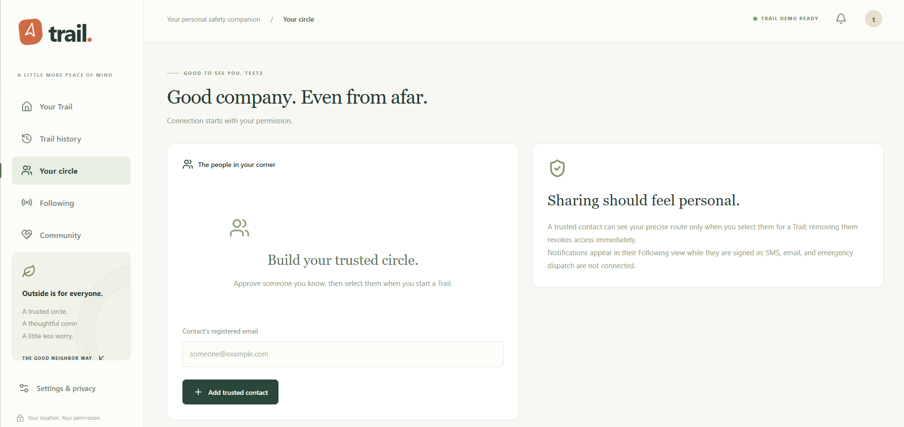
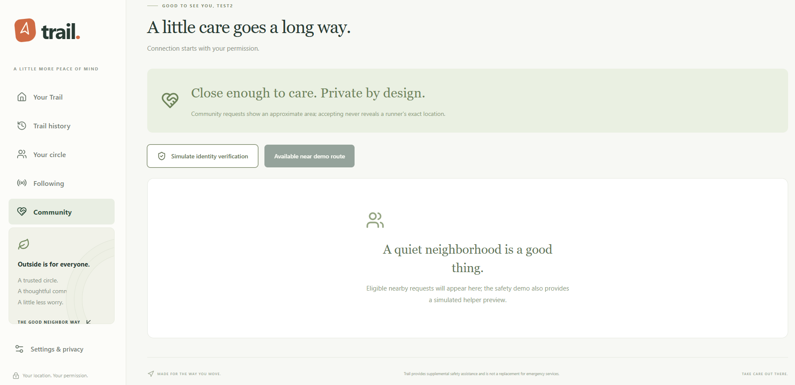
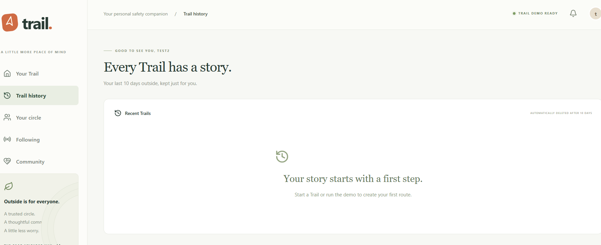

# Project Features

### Live Trail Tracking

Start a Trail session and securely share it with selected trusted contacts.

Trail tracks:

* Current location
* Route
* Distance
* Elapsed time
* Movement speed
* Running, walking, and stopped states
* Stops and pauses

WebSockets provide live session updates between the backend and authorized users.

### Trusted Contacts

Users can create a private circle of trusted friends and family.

Selected contacts can follow an active Trail and view the runner's authorized:

* Live location
* Route
* Movement status
* Last update
* Safety status

Only people given permission can access the session.

### AI Safety Monitoring

Trail analyzes session information while a person is outside.

The system looks at:

* Unusual stops
* Long periods of inactivity
* Route conditions
* Isolation estimates
* Route familiarity
* Movement changes

When enough evidence suggests something unusual has happened, Trail can start a safety check-in.

### Smart Safety Check-Ins

Trail does not treat every stop as an emergency.

Instead, the runner first receives a check-in:

**"Trail noticed something unusual. Are you okay?"**

The runner can respond:

**I'm OK** — Trail closes the safety event.

**Need Help** — Trail alerts the runner's selected trusted contacts.

An unanswered check-in can also be escalated after the configured timeout.

### Community Safety Network

Users can optionally participate in Trail's community safety network.

When the required safety and privacy conditions are met, Trail can identify up to five nearby verified community helpers.

Community members do **not** receive the runner's exact coordinates or identity. They initially receive only an approximate area where assistance may be needed.

The current version uses simulated identity verification and simulated community members.

### 10-Day Trail History

Trail privately stores route history for up to 10 days.

Previous Trails include information such as:

* Route
* Date
* Distance
* Duration
* Stops
* Location bookmarks

Expired route data is automatically removed according to the configured retention period.

### Lost Item Retracing

If a user loses something during a run or walk, Trail can analyze a previous route and suggest places worth searching.

Trail considers events such as:

* Longer stops
* Sudden pace changes
* Turns
* Rest locations
* Manually saved bookmarks

These locations are only suggestions. Trail cannot determine the actual location of a lost item.
