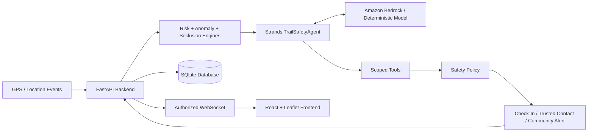

# Project Setup & Technical Documentation

## Architecture



Additional documentation is available in:

* `docs/architecture.md`
* `docs/architecture.mmd`
* `docs/security.md`
* `docs/aws-deployment.md`

## Tech Stack

### Frontend

* React 19
* TypeScript
* Vite
* Tailwind CSS 4
* Leaflet
* OpenStreetMap
* Lucide

### Backend

* Python
* FastAPI
* SQLAlchemy
* SQLite
* Pydantic
* WebSockets

### AI / ML

* Strands Agents SDK
* Amazon Bedrock (optional)
* NumPy
* Statistical anomaly detection
* scikit-learn available for future fitted models

### Security & Infrastructure

* JWT
* Argon2
* Docker
* Nginx
* pytest


## Project Structure

```text
trail/
├── backend/
│   ├── app/
│   │   ├── api/
│   │   ├── agents/
│   │   ├── core/
│   │   ├── ml/
│   │   ├── models/
│   │   ├── schemas/
│   │   ├── services/
│   │   ├── tools/
│   │   └── main.py
│   └── tests/
│
├── frontend/
│   └── src/
│
├── scripts/
├── docs/
├── docker-compose.yml
├── .env.example
├── LICENSE
└── README.md
```

## Installation

### Requirements

* Python 3.13
* Node.js 22+
* npm

Clone the repository and create a Python environment:

```powershell
python -m venv .venv

.\.venv\Scripts\python.exe -m pip install -r backend/requirements.txt

.\.venv\Scripts\python.exe scripts/setup_env.py
```

Start the backend:

```powershell
.\.venv\Scripts\python.exe -m uvicorn app.main:app --app-dir backend --host 127.0.0.1 --port 8000
```

Open another terminal and start the frontend:

```powershell
cd frontend

npm ci

npm run dev
```

Trail will be available at:

`http://127.0.0.1:5173`

On macOS or Linux, replace:

```text
.\.venv\Scripts\python.exe
```

with:

```text
.venv/bin/python
```

## Using Trail

Create an account or sign in.

Add another registered Trail user to **Your Circle** and select the trusted contacts who should be able to follow your session.

Choose **Start Trail** to begin location tracking.

Browser location permission is requested for real GPS sessions.

Trail supports localhost and HTTPS. Browser-based background tracking is not guaranteed when the screen is locked or the browser is suspended.

### Simulation Mode

Trail also includes simulation tools for testing the safety system without physically running outside.

Two scenarios are available:

**Normal Run**

The simulated runner stops and confirms that they are okay. Trail closes the check-in without escalation.

**Safety Scenario**

The runner enters simulated isolated conditions, stops unexpectedly, and leaves a safety check-in unanswered.

The same application pipeline then processes:

```text
Simulated GPS
     ↓
Session Processing
     ↓
Risk + Anomaly Analysis
     ↓
TrailSafetyAgent
     ↓
Check-In
     ↓
Trusted Contact Alert
     ↓
Privacy-Protected Community Request
```

Simulation data passes through the real backend, database, safety rules, and Strands agent.

## Environment Configuration

Important environment variables include:

```env
DATABASE_URL=sqlite:///./trail.db

JWT_SECRET=your-random-secret

TRAIL_AGENT_MODE=mock

AWS_REGION=us-west-2

BEDROCK_MODEL_ID=global.anthropic.claude-sonnet-4-6

DEMO_MODE=true

CHECKIN_TIMEOUT_SECONDS=15

PRODUCTION_CHECKIN_TIMEOUT_SECONDS=120

STOP_THRESHOLD_SECONDS=120

COMMUNITY_RADIUS_KM=2

COMMUNITY_RISK_THRESHOLD=60

ROUTE_RETENTION_DAYS=10
```

`scripts/setup_env.py` generates a random local signing secret automatically.

Never commit real credentials.

## Amazon Bedrock

Trail supports two agent modes.

### Deterministic Mode

```env
TRAIL_AGENT_MODE=mock
```

A deterministic Strands model produces native tool calls through the Strands SDK.

This allows Trail's agent architecture to operate locally without paid AI APIs.

### Bedrock Mode

```env
TRAIL_AGENT_MODE=bedrock
```

Trail uses Amazon Bedrock for contextual reasoning and tool selection while keeping the same tools and deterministic safety policies.

Configure an AWS profile or role with Bedrock access before enabling this mode.

AWS credentials should never be committed or included in frontend code.

## Testing

Run backend tests:

```powershell
cd backend
..\.venv\Scripts\python.exe -m pytest
```

Check and build the frontend:

```powershell
cd frontend

npm run typecheck

npm run build
```

Trail includes tests for authentication, authorization, session processing, privacy controls, AI-agent behavior, retention, safety scenarios, and community coordinate protection.

## Docker

Generate the local configuration:

```powershell
python scripts/setup_env.py
```

Then start Trail:

```powershell
docker compose up --build
```

The containerized application is available at:

`http://127.0.0.1:8080`

Stop it with:

```powershell
docker compose down
```

SQLite data is stored in a Docker volume and remains available between restarts.

## AI Usage Acknowledgement

AI tools, including OpenAI Codex, were used to assist with code development, debugging, documentation, and project refinement.
