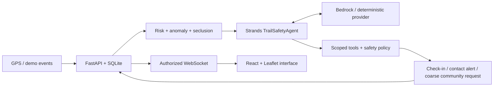

# Trail

**Run freely. Trail watches your back.**

A mobile-first safety companion for runners, walkers, and joggers, built for the **AWS Agents for Humans Hackathon · Good Neighbor Agents** track.

Trail connects a person outside with the people who care about them and a permission-based community network; a Strands safety agent monitors session evidence, checks in before escalating, and explains its actions in a live timeline.

> Trail provides supplemental safety assistance and is not a replacement for emergency services.

## The problem

Going for a solo run should not mean repeatedly managing location links, sending reassurance messages, and asking someone to watch a dot on a map; location sharing becomes more useful when an assistant notices changes and asks the right person for attention at the right time.

## The solution

Start a Trail, choose your trusted contacts, and go outside; Trail records your route, evaluates movement evidence, checks in when something seems unusual, and creates an in-app contact alert if you request help or leave a check-in unanswered.

The optional community network evaluates up to five simulated verified helpers and shares a fixed approximate zone after policy gates pass; your exact coordinates and identity are never included in community payloads, even after acceptance.

## Why Trail

Trail combines consent-based live sharing, understandable autonomous intervention, ten-day private retracing, and community assistance in one workflow; its focus is personal safety and connection, rather than fitness performance.

## What works

- Registration, login, logout, private profiles, emergency-contact details, and explicit trusted contacts.
- Live foreground GPS ingestion, haversine distance, calculated speed, movement state, elapsed time, pauses, and location bookmarks.
- Authorized Leaflet/OpenStreetMap route views, WebSocket updates, and trusted-contact Following views.
- Explainable route-risk and seclusion estimates on clearly labelled simulated environmental data.
- Statistical motion anomaly detection using median/MAD pace evidence and prolonged stopping or inactivity.
- A genuine Strands `Agent` with twelve scoped tools, deterministic safety gates, persisted decisions, and SDK metrics.
- Check-in countdowns, OK/help responses, SOS, durable in-app alerts, and approximate community requests.
- Deterministic normal and safety demos that feed the real sensor/agent/database pipeline.
- Private ten-day history with recorded route previews and ranked lost-item search locations.
- Docker configuration, backend tests, live smoke scripts, architecture documentation, Devpost draft, and a four-minute video script.

## Try the complete local demo

Use Python **3.13** and Node.js **22+**; the commands below start in the repository root on Windows PowerShell.

```powershell
# Create isolated dependencies and an ignored, randomly generated local signing key.
python -m venv .venv
.\.venv\Scripts\python.exe -m pip install -r backend/requirements.txt
.\.venv\Scripts\python.exe scripts/setup_env.py

# Start the backend in this terminal; keep it running.
.\.venv\Scripts\python.exe -m uvicorn app.main:app --app-dir backend --host 127.0.0.1 --port 8000
```

Open a second terminal:

```powershell
# Install the locked frontend dependencies and start the same-origin development proxy.
cd frontend
npm ci
npm run dev
```

Open [Trail](http://127.0.0.1:5173), choose **Run safety demo**, and leave its check-in unanswered; the button creates a disposable demo account if needed and explicitly enables sample-contact sharing and simulated community participation.

The route progresses for about twenty-five seconds, followed by a fifteen-second check-in; the contact alert, approximate community request, five eligible helper evaluations, and one simulated acceptance appear in the timeline.

Use **Following → Preview demo recipients** and **Community → Preview demo recipients** to see owner-authorized sample recipient views; end the Trail before choosing **Or try a normal run**, which automatically responds OK and closes the check-in without escalation.

For a reusable account, use **Sign in → Create an account** instead of relying on the disposable demo account; its generated password is intentionally not displayed or stored in browser-accessible storage.

On macOS/Linux, replace `.\.venv\Scripts\python.exe` with `.venv/bin/python`; all Python scripts otherwise use the same arguments.

## Running real foreground GPS

Create or sign in to a normal account, add another registered Trail user in **Your circle**, select that contact on the dashboard, and choose **Start Trail**; browser location permission is requested only for this flow.

The app works on localhost or HTTPS, and browser background/screen-lock tracking is not guaranteed; live environmental risk remains **Unavailable** because a real environmental provider has not been configured, while motion and missing-update check-ins still work.

**SOS creates an in-app notification only**; if you are in immediate danger, contact local emergency services.

## How AI/ML works

| Feature | Implementation | Interpretation |
|---|---|---|
| Route risk | Weighted isolation, darkness, road distance, familiarity, stopping, safe-point, and helper factors | Experimental index from 0–100; simulated data is labelled |
| Abnormal stopping | Robust median/MAD pace statistics plus stop-duration and inactivity features | Anomaly evidence, not a medical diagnosis |
| Smart check-in | Contextual Strands tool choice within deterministic evidence and state gates | Ask the runner first; escalate only on help or timeout |
| Seclusion | Weighted normalized isolation, road distance, darkness, and familiarity | 0–1 heuristic; not a statement that an area is dangerous |
| Safer route | Minimum-cost choice between illustrative route candidates | Not turn-by-turn or verified navigation |
| Lost-item retracing | Ranked pauses, sharp pace changes, turns, and manual marks | Possible places to search; never a known item location |

`RiskEngine` accepts an environmental-provider interface; `DemoEnvironment` is reproducible and `RealEnvironment` fails explicitly until an actual source is integrated, so simulated data is never silently applied to a live GPS session.

## How Strands is used

`backend/app/agents/safety_agent.py` constructs a real Strands `Agent`, registers the twelve `@tool` functions in `backend/app/tools/__init__.py`, invokes `invoke_async` on structured session state, and records tool metrics alongside application decisions.

With `TRAIL_AGENT_MODE=mock`, a deterministic custom Strands `Model` emits native tool calls through the installed SDK; with `TRAIL_AGENT_MODE=bedrock`, `BedrockModel` performs contextual reasoning and tool selection using the same scoped toolset.

Every mutating tool independently checks current policy, so a model cannot notify contacts before authorization or release precise community coordinates; required actions also run through a deterministic fallback if inference fails or exceeds its time budget.

See [architecture](docs/architecture.md) for exact thresholds, state transitions, and the documented single-worker concurrency tradeoff.

## Architecture



[Full architecture source](docs/architecture.mmd) · [Privacy and safety](docs/security.md) · [AWS deployment notes](docs/aws-deployment.md)

## Project layout

```text
backend/app/
  api/         Authentication and authorized REST endpoints
  agents/      Strands orchestrator and offline model provider
  core/        Configuration, Argon2/JWT authentication, SQLAlchemy
  ml/          Explainable experimental engines
  models/      Ten relational models with retention cascades
  schemas/     Pydantic request validation
  services/    Session processing, privacy policy, and simulation
  tools/       Twelve scoped Strands tools
  main.py      FastAPI lifecycle, watchdog, and WebSocket service
backend/tests/ API, privacy, engine, agent, retention, and demo tests
frontend/src/  React/TypeScript pages, Leaflet components, hooks, and services
scripts/       Configuration, seeding, live smoke, and Bedrock verification
docs/          Architecture, security, deployment, Devpost, and video script
```

## Tech stack

React 19, TypeScript, Vite, Tailwind CSS 4, Lucide icons, Leaflet/OpenStreetMap, FastAPI, SQLAlchemy/SQLite, Pydantic, NumPy, Strands Agents SDK, optional Amazon Bedrock, JWT/Argon2, pytest, Docker, and Nginx; scikit-learn is installed for future fitted anomaly models, while the implemented detector uses transparent NumPy statistics.

## Environment variables

Copying `.env.example` manually is unnecessary when using `scripts/setup_env.py`, which generates a random secret and preserves any existing `.env`.

| Variable | Default / purpose |
|---|---|
| `DATABASE_URL` | `sqlite:///./trail.db`, relative to the backend process working directory |
| `JWT_SECRET` | Required random secret, at least 32 characters; setup script generates it |
| `TRAIL_AGENT_MODE` | `mock` or `bedrock` |
| `AWS_REGION` | `us-west-2` |
| `BEDROCK_MODEL_ID` | Configurable default `global.anthropic.claude-sonnet-4-6` |
| `DEMO_MODE` | `true`; enables simulations and simulated identity verification |
| `CHECKIN_TIMEOUT_SECONDS` | `15`, used only for simulated sessions |
| `PRODUCTION_CHECKIN_TIMEOUT_SECONDS` | `120`, used for real GPS sessions |
| `STOP_THRESHOLD_SECONDS` | `120`, mandatory prolonged-stop threshold |
| `COMMUNITY_RADIUS_KM` | `2`, helper discovery radius; the displayed coarse zone is 1.6 km |
| `COMMUNITY_RISK_THRESHOLD` | `60`, minimum score for a community request |
| `ROUTE_RETENTION_DAYS` | `10`, maximum route lifetime |
| `CORS_ORIGINS` | Local frontend origins; set to the exact HTTPS origin when deploying |
| `COOKIE_SECURE` | `false` for local HTTP; use `true` with HTTPS |

## Tests and verification

```powershell
# Run backend tests in their isolated database.
cd backend
..\.venv\Scripts\python.exe -m pytest
cd ..

# Check TypeScript and build distributable frontend assets.
cd frontend
npm run typecheck
npm run build
cd ..

# With the backend running, seed isolated examples and exercise both timed demos.
.\.venv\Scripts\python.exe scripts/seed_demo.py
.\.venv\Scripts\python.exe scripts/simulate_run.py
```

The live smoke script checks health, both timed scenarios, actual Strands completion without fallback, five-helper selection, acceptance, community coordinate redaction, ten-day history availability, lost-item analysis, and unauthorized session access; reports are written under ignored `.local/` without credentials.

Swagger documentation is available at [API docs](http://127.0.0.1:8000/docs), and [health](http://127.0.0.1:8000/health) reports the active provider and delivery mode.

## Docker

```powershell
# Generate the local secret once, then start both services with durable SQLite storage.
python scripts/setup_env.py
docker compose up --build
```

Open [containerized Trail](http://127.0.0.1:8080); the API is internal, Nginx proxies HTTP and WebSockets, and a named volume stores SQLite data across container restarts.

Use `docker compose down` to stop the services while preserving history; no cloud deployment is performed by these commands.

## AWS / Bedrock setup

Configure an AWS profile or role with Bedrock model access, change `TRAIL_AGENT_MODE=bedrock` in `.env`, set an accessible model ID and region, and restart the API; never commit AWS keys or put them in frontend code.

Run `python scripts/check_bedrock.py` for a synthetic Bedrock-backed Strands check that can incur model usage charges; it uses an isolated in-memory database and does not send real route coordinates or personal identifiers.

[AWS notes](docs/aws-deployment.md) explain the deployment boundary and optional AgentCore migration; AgentCore deployment is not implemented because the local transaction-bound tools and watchdog need a distributed redesign first.

## Screenshots

Capture the finished desktop dashboard, mobile check-in, community zone, and lost-item view when recording the submission; screenshot placeholders are intentionally separate from claims about automated verification.

- `docs/screenshots/dashboard.png` — desktop live map and trusted circle.
- `docs/screenshots/checkin.png` — mobile countdown with OK/help choices.
- `docs/screenshots/community.png` — approximate helper zone.
- `docs/screenshots/retrace.png` — possible search points on a saved route.

## Limitations and future improvements

This MVP uses simulated identity verification, simulated environmental signals and route candidates, foreground browser GPS, and in-app notifications; it does not provide real SMS/email/push delivery, validated safety predictions, real identity checks, native background tracking, or emergency-service dispatch.

Next priorities are durable scheduling outside request transactions, native mobile background location, independently validated notification delivery, real environmental/routing providers, consent-aware identity verification and moderation, encrypted storage, account export/deletion, operational monitoring, and a distributed agent runtime.

OpenStreetMap tiles require network access and reveal the viewed map area to the tile provider; the application still stores routes and runs its offline agent without paid AI APIs, but maps are not bundled for offline use.

## Hackathon submission

Trail fits **Good Neighbor Agents** by coordinating people around permission-based care: the agent reduces monitoring work for trusted contacts and invites limited community assistance while preserving precise location privacy.

Use [Devpost draft](docs/devpost.md), [four-minute demo script](docs/demo-script.md), and [implementation status](IMPLEMENTATION_STATUS.md); public repository publication, video recording/upload, Builder ID entry, and Devpost submission remain human submission steps.

## License

[MIT](LICENSE).
