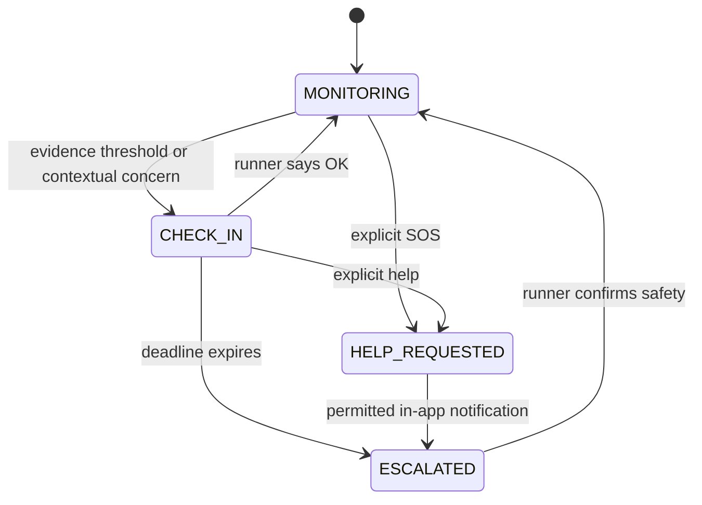

# Trail architecture

Trail is a local-first MVP built for the Good Neighbor Agents track; the application coordinates a runner, explicitly approved contacts, and a small community network through persisted safety events.

## Processing flow

1. A runner creates a session with individually selected contact IDs and a community consent flag.
2. Foreground GPS or the server-side demo simulator supplies validated locations; the API calculates haversine distance, speed, motion, pause duration, environmental risk, and statistical anomaly evidence.
3. The one-second watchdog recovers sessions from SQLite, advances demo events, evaluates unanswered check-ins, and periodically invokes `TrailSafetyAgent`.
4. A Strands `Agent` receives sanitized JSON without names, contact details, or precise coordinates; it invokes session-scoped `@tool` functions to inspect evidence and take policy-controlled actions.
5. Mutating tools recheck safety state, sharing permission, consent, thresholds, and deadlines; mandatory policy actions also run after model failure.
6. SQLAlchemy stores route points, safety events, risk snapshots, agent decisions, helper requests, and lost-item searches; authorized WebSockets refresh the frontend every second.

The full diagram is in [architecture.mmd](architecture.mmd).

## Strands is the orchestrator

Both providers instantiate the installed Strands `Agent`, register twelve custom tools, call `invoke_async`, and capture SDK tool metrics; mock mode is a deterministic custom `Model` that emits native tool calls through the real SDK loop, while Bedrock mode delegates tool selection to the configured Amazon model.

The offline provider is deliberately labelled deterministic; its bounded tool plan comes from engine evidence and policy eligibility, and it must not be represented as live LLM reasoning.

The toolset includes session status, risk, anomaly, seclusion, approved recipient count, check-in creation, trusted-contact notification, nearby helper evaluation, coarse community alerts, route alternatives, lost-item route inspection, and decision logging; tool closures prevent the model from selecting another account or session, and each live tool reloads current state in its own short transaction.

## Explainable experimental engines

| Engine | Implemented approach | Boundaries |
|---|---|---|
| Route risk | Weighted contributions for isolation, darkness, road distance, familiarity, stopping, safe points, deviation input, and helper availability | 0–100 heuristic; no crime dataset or calibrated probability |
| Seclusion | Weighted normalized isolation, road distance, darkness, and unfamiliarity | Demo signals only until a real provider is configured |
| Motion anomaly | Median moving speed, median absolute deviation, robust z-score, stop duration, and inactivity | Statistical heuristic, no medical inference |
| Safer route | Minimum-cost selection between explicit simulated route candidates | Illustrative geometry, not verified pedestrian navigation |
| Lost item | Ranked pauses, sharp slowdowns, turns, and manually marked points with spatial deduplication | Possible search points, never a detected item |

`EnvironmentProvider` separates demo and real data sources; `RealEnvironment` explicitly returns unavailable rather than simulating live safety data, and the deviation features are extensibility inputs rather than an implemented learned familiar-route model.

## State machine



Required check-ins trigger for anomaly above 0.75 with a prolonged stop, or sustained loss of location updates; elevated simulated risk plus a shorter stop gives the agent contextual permission to check in earlier, but cannot itself authorize trusted-contact escalation.

## Persistence and deployment

The SQLite deployment runs one Uvicorn worker and serializes short mutations with an in-process lock; live inference runs outside database transactions with a 60-second budget and at most three concurrent agent tasks.

The public judging architecture uses persistent Lightsail disk, Docker Compose, Caddy HTTPS, and Nginx; every actual tool reloads session state and revalidates permissions before writing, while ended sessions reject late agent actions.

An API restart resumes persisted active sessions and check-in deadlines; routes and all session-derived data are removed once the session start exceeds ten days, with cleanup at startup and at most sixty seconds between subsequent passes.

## Realtime and notifications

The WebSocket authenticates with the HttpOnly session cookie and revalidates JWT revocation and sharing before every snapshot; it never accepts a JWT in a URL, and community views use an allowlisted coarse serializer instead of the precise route serializer.

Trusted-contact notifications are durable in-app events surfaced in the Following view; the demo recipient preview is restricted to the owner of a simulated session and does not impersonate another account or provide account-switch credentials.

## Primary technical references

- [Strands Python quickstart](https://strandsagents.com/docs/user-guide/quickstart/python/)
- [Strands tools](https://strandsagents.com/docs/user-guide/concepts/tools/)
- [Strands custom model providers](https://strandsagents.com/docs/user-guide/concepts/model-providers/custom_model_provider/)

Trail's implemented local architecture and Bedrock provider option.

```
flowchart TD
    Runner[React client: runner / contact / helper] -->|Argon2 login, HttpOnly JWT| API[FastAPI API]
    Sensors[GPS events or deterministic demo sensor events] --> API
    API --> DB[(SQLite / SQLAlchemy)]
    API --> Engines[Risk Engine + statistical Anomaly Detector + Seclusion Engine]
    Worker[Persisted session watchdog: every second] --> Engines
    Engines --> State[Sanitized structured session state]
    State --> Agent[Strands TrailSafetyAgent]
    Agent <-->|Real model mode| Bedrock[Amazon Bedrock]
    Agent <-->|Offline mode: actual SDK loop| Mock[Deterministic custom model provider]
    Agent --> Tools[Session-scoped @tool functions]
    Tools --> Policy[Deterministic policy / consent / deadline gates]
    Worker -->|Mandatory fallback| Policy
    Policy --> Checkin[Runner check-in]
    Policy --> Contact[Trusted contact in-app notification]
    Policy --> Route[Labelled alternative route]
    Policy --> Community[Opted-in community network: fixed coarse zone]
    Tools --> Audit[Decision events + SDK metrics]
    Audit --> DB
    DB --> WS[Authorized WebSocket service]
    WS -->|Recheck consent each snapshot| Runner
    DB --> Cleanup[10-day cascading deletion]
```
